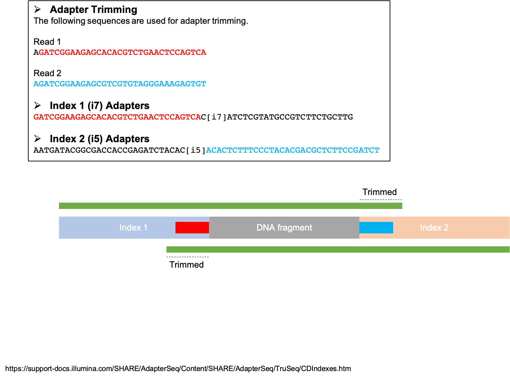

Bioinformatics
**************

Frequently used commands for Bioinformatics
===========================================

To extract read names from a FASTQ file:

.. code-block:: text

    $ gunzip -c sample.fastq.gz | paste - - - - | cut -f 1 | head

To extract regions from a BED file:

.. code-block:: text

    $ awk '{print $1":"$2"-"$3}' example.bed | sed 's/chr//g' > regions.list

To zip a VCF file:

.. code-block:: text

    $ bgzip -c sample.vcf > sample.vcf.gz

To index a VCF file:

.. code-block:: text

    $ tabix -p vcf sample.vcf.gz

To rename the ``chr`` string in a VCF file:

.. code-block:: text

    $ echo "1 chr1" >> chr_name_conv.txt
    $ echo "2 chr2" >> chr_name_conv.txt
    $ bcftools annotate --rename-chrs chr_name_conv.txt original.vcf.gz | bgzip > rename.vcf.gz

To slice a VCF file:

.. code-block:: text

    $ tabix -h sample.vcf.gz chr1:1000-2000 > sliced.vcf.gz

To slice a VCF file without using tabix:

.. code-block:: text

    $ zcat sample.vcf.gz | awk '{OFS="\t"; if ($2 > 1000 && $2 < 2000){ print }}'

To count the number of sequence reads in a FASTQ file:

.. code-block:: text

    $ echo $(cat sample.fastq | wc -l) / 4 | bc

To count the number of sequence reads in a zipped FASTQ file:

.. code-block:: text

    $ echo $(zcat sample.fastq | wc -l) / 4 | bc

To count the number of sequence reads in a zipped FASTQ file (macOS):

.. code-block:: text

    $ echo $(zcat < sample.fastq.gz | wc -l) / 4 | bc

To extract only sequence reads from a zipped FASTQ file:

.. code-block:: text

    $ zcat sample.fastq.gz | awk '{if (NR% 4 == 2) print $0}'

To extract exon coordinates for a gene:

.. code-block:: text

    $ grep -w "CYP2A6" Homo_sapiens.GRCh37.75.gtf | grep "CYP2A6-001" | grep -w "exon" | cut -f 1,4,5,9 -d$'\t' | cut -f 1,3 -d';' | sed 's/gene_id "ENSG00000255974"; //g'

To extract rpkm values from a .gct file:

.. code-block:: text

    $ printf "`echo $sample`\t`grep -w "CYP2A7" /net/grc/vol6/data/processed/samples/$sample/RNA_SEQ/qc/genes.rpkm.gct`\n"

To extract sequence headers from a FASTA file:

.. code-block:: text

    $ grep -e ">" example.fasta

GTCtoVCF
========

Here's the `link <https://github.com/Illumina/GTCtoVCF>`__ to the GTCtoVCF program.

gtc2vcf
=======

Here's the `link <https://github.com/freeseek/gtc2vcf>`__ to the gtc2vcf program.

bcl2fastq
=========

Introduction
------------

bcl2fastq is a software tool developed by Illumina Inc. for demultiplexing sequence read data. The official documentation is available `here <https://sapac.support.illumina.com/content/dam/illumina-support/documents/documentation/software_documentation/bcl2fastq/bcl2fastq2-v2-20-software-guide-15051736-03.pdf>`__.

+--------------------------+-------+----------------------+
| Platform                 | Lanes | Fluidically distinct |
+==========================+=======+======================+
| MiSeq                    | 1     | N/A                  |
+--------------------------+-------+----------------------+
| HiSeq - Rapid Mode       | 2     | Yes                  |
+--------------------------+-------+----------------------+
| HiSeq - High Output Mode | 8     | Yes                  |
+--------------------------+-------+----------------------+
| HiSeq X Ten              | 8     | Yes                  |
+--------------------------+-------+----------------------+
| NextSeq                  | 4     | No                   |
+--------------------------+-------+----------------------+
| NovaSeq S1, S2           | 2     | Yes with XP protocol |
+--------------------------+-------+----------------------+
| NovaSeq S3, S4           | 4     | Yes with XP protocol |
+--------------------------+-------+----------------------+

Commonly used options
---------------------

* ``--no-lane-splitting``

    Do not split FASTQ files by lane.

* ``--barcode-mismatches``

    | Specifies how to process each cycle:
    | * ``n`` - Ignore the cycle.
    | * ``Y`` (or ``y``) - Use the cycle.
    | * ``I`` - Use the cycle for an Index Read.
    | * A number - Repeat the previous character the indicated number of times.
    | * ``*`` - Repeat the previous character until the end of the read or index (length per ``RunInfo.xml``).
    | Commas separate read masks. The format for dual indexing is the following syntax or specified variations:
    | ``--use-bases-mask Y*,I*,I*,Y*``
    | You can also specify `--use-bases-mask` multiple times for separate lanes. In the following example, ``1:`` indicates that the setting applies to lane 1. The second ``--use-bases-mask`` parameter applies to all other lanes.
    | ``--use-bases-mask 1:y*,i*,i*,y* --use-bases-mask y*,n*,n*,y*``
    | If this option is not specified, ``RunInfo.xml`` determines the mask. If it cannot determine the mask, specify the `--use-bases-mask` option. When specified, the number of index cycles and the index length in the sample sheet must match.

* ``--tiles``

    | Selects a subset of available tiles for processing. To make multiple selections, separate the regular expressions with commas. For example:
    | To select all tiles ending with 5 in all lanes:
    | ``--tiles [0–9][0–9][0–9]5``
    | To select tile 2 in lane 1 and all the tiles in the other lanes:
    | ``--tiles s_1_0002,s_[2-8]``

Running
-------

**Case 1. MiSeq, 2x300 bp reads, dual indexing**

.. code-block:: text

    $ bcl2fastq \
      --output-dir $OUTPUT_DIR \
      --sample-sheet $SAMPLE_SHEET \
      --runfolder-dir $RUNFOLDER_DIR \
      --interop-dir $OUTPUT_DIR/Interop \
      --stats-dir $OUTPUT_DIR/Stats \
      --reports-dir $OUTPUT_DIR/Reports \
      --no-lane-splitting \
      --use-bases-mask Y301,I8,I8,Y301 \
      --barcode-mismatches 0 \
      --processing-threads 10

**Case 2. NextSeq, 2x150 bp reads, single indexing**

.. code-block:: text

    $ bcl2fastq \
      --output-dir $OUTPUT_DIR\
      --sample-sheet $SAMPLE_SHEET \
      --runfolder-dir $RUNFOLDER_DIR \
      --interop-dir $OUTPUT_DIR/Interop \
      --stats-dir $OUTPUT_DIR/Stats \
      --reports-dir $OUTPUT_DIR/Reports \
      --no-lane-splitting \
      --tiles s_1,s_2,s_3,s_4 \
      --use-bases-mask Y151,I8,Y151 \
      --barcode-mismatches 0 \
      --processing-threads 20

Cutadapt
========

Cutadapt finds and removes adapter sequences, primers, poly-A tails and other types of unwanted sequence from your high-throughput sequencing reads.

Trim Galore!
============

Trim Galore! is a wrapper tool around Cutadapt and FastQC to consistently apply quality and adapter trimming to FastQ files, with some extra functionality for MspI-digested RRBS-type (Reduced Representation Bisufite-Seq) libraries.

FastQC
======

`FastQC <https://www.bioinformatics.babraham.ac.uk/projects/fastqc/>`__ is a quality control tool for high throughput sequence data.

Bias in per base sequence content
---------------------------------

Many RNAseq beginners get worried when they see a "per base sequence content" plot that looks like below:

.. image:: https://sequencing.qcfail.com/wp-content/uploads/sites/2/2016/01/random_priming_bias.png

According to this `post`__ the cause of this bias is "the random priming step in library production. The priming should be driven by a selection of random hexamers which in theory should all be present with equal frequency in the priming mix and should all prime with equal efficiency.  In the real world it turns out that this isn’t the case and that certain hexamers are favoured during the priming step, resulting in the based composition over the region of the library primed by the random primers."

SAMtools
========

Frequently used commands for SAMtools
-------------------------------------

Extract sequence reads of a BAM file:

.. code-block:: text

    $ samtools view in.bam

Extract the header of a BAM file:

.. code-block:: text

    $ samtools view -H in.bam

Index a BAM file:

.. code-block:: text

    $ samtools index in.bam

Index a FASTA file:

.. code-block:: text

    $ samtools faidx ref.fa -o ref.fa.fai

Slice a BAM file:

.. code-block:: text

    $ samtools view -b in.bam "chr1:10-20" > out.bam

Merge two BAM files:

.. code-block:: text

    $ samtools merge -o out.bam in1.bam in2.bam

Get sample ID for a BAM file:

.. code-block:: text

    $ samtools view -H sample.bam | grep "^@RG" | sed "s/.*SM:\([^\t]*\).*/\1/g" | uniq

Get read length for a BAM file:

.. code-block:: text

    $ samtools view in.bam | head -n 1000000 | cut -f 10 | perl -ne 'chomp;print length($_) . "\n"' | sort | uniq -c

Get coverage over regions from multiple BAM files:

.. code-block:: text

    $ xargs -a bam.list samtools bedcov in.bed > out.txt

BCFtools
========

Variant calling pipeline
------------------------

1. Calculate genotype likelihoods at each genomic position with coverage. Note that the reference FASTA file and the input BAM file(s) must have the same chromosome string style.

    .. code-block:: text

        $ bcftools mpileup -Ou -q 1 -a AD --max-depth 1000 -f ref.fa -r chr1:1000-2000 -o sample.bcf sample.bam

2. Make variant calls.

    .. code-block:: text

        $ bcftools call -Oz -mv -o sample.vcf.gz sample.bcf

3. Index the VCF file.

    .. code-block:: text

        $ bcftools index sample.vcf.gz

4. Left-align and normalize indels.

    .. code-block:: text

        $ bcftools norm -Ob -f ref.fa -o sample.normalized.bcf sample.vcf.gz

5. Filter variants.

    .. code-block:: text

        $ bcftools filter -Ov --IndelGap 5 -o sample.normalized.filtered.vcf sample.normalized.bcf

SnpEff and SnpSift
==================

* To download the pre-built human database (GRCh37.75):

    .. code-block:: text

        $ java -jar snpEff.jar download -v GRCh37.75

* To run annotation:

    .. code-block:: text

        $ java -jar snpEff.jar eff hg19 in.vcf > ann.vcf

Genome Analysis Toolkit (GATK)
==============================

Pipeline for germline short variant discovery
---------------------------------------------

This pipeline is based on GATK Team's Best Practices Workflows for `Germline short variant discovery (SNPs + Indels) <https://gatk.broadinstitute.org/hc/en-us/articles/360035535932-Germline-short-variant-discovery-SNPs-Indels->`__.

Call variants per-sample
^^^^^^^^^^^^^^^^^^^^^^^^

.. code-block:: text

    $ gatk HaplotypeCaller \
      -R ref.fa \
      --emit-ref-confidence GVCF \
      -I sample.bam \
      -O sample.g.vcf
      -L chr5:500-1000 \
      --QUIET \
      --java-options "-Xmx4G"

Consolidate GVCFs
^^^^^^^^^^^^^^^^^

.. code-block:: text

    $ gatk GenomicsDBImport \
      --intervals chr5:500-1000 \
      --genomicsdb-workspace-path output_dir/temp/datastore \
      --merge-input-intervals \
      --QUIET \
      --java-options "-Xmx4G" \
      -V sample1.g.vcf \
      -V sample2.g.vcf

Joint-Call Cohort
^^^^^^^^^^^^^^^^^

.. code-block:: text

    $ gatk GenotypeGVCFs \
      -R ref.fa \
      -V gendb://output_dir/temp/datastore \
      -O output_dir/temp/germline.joint.vcf \
      --QUIET \
      --java-options "-Xmx4G" \
      -D dbsnp.vcf

.. note::
    According to this `post <https://gatk.broadinstitute.org/hc/en-us/articles/360035889971--How-to-Consolidate-GVCFs-for-joint-calling-with-GenotypeGVCFs>`__, if you get an error like ``Could not open array genomicsdb_array at workspace:[...]`` from ``GenotypeGVCFs``, you need to check whether you're working on a POSIX filesystem (e.g. Lustre, NFS, xfs, ext4, etc.). If you are, then you must set the environment variable ``TILEDB_DISABLE_FILE_LOCKING=1`` before running any GenomicsDB tool.

Filter variants
^^^^^^^^^^^^^^^

.. code-block:: text

    $ gatk VariantFiltration \
      -R ref.fa \
      -L chr5:500-1000 \
      -O germline.joint.filtered.vcf \
      --variant $output_dir/temp/germline.joint.vcf \
      --filter-expression 'QUAL <= 50.0' \
      --filter-name QUALFilter \
      --QUIET \
      --java-options "-Xmx4G"

Pipeline for somatic short variant discovery
--------------------------------------------

This pipeline is based on GATK Team's Best Practices Workflows for `Somatic short variant discovery (SNVs + Indels) <https://gatk.broadinstitute.org/hc/en-us/articles/360035894731>`__.

Click `here <https://github.com/broadinstitute/gatk/blob/master/docs/mutect/mutect.pdf>`__ to see the official documentation for Mutect2.

Tumor with matched normal
^^^^^^^^^^^^^^^^^^^^^^^^^

.. code-block:: text

    $ gatk Mutect2 \
      -R reference.fa \
      -I tumor.bam \
      -I normal.bam \
      -normal normal_sample_name \
      --germline-resource af-only-gnomad.vcf.gz \
      --panel-of-normals pon.vcf.gz \
      -O somatic.vcf.gz

Filter variants in a Mutect2 VCF callset
^^^^^^^^^^^^^^^^^^^^^^^^^^^^^^^^^^^^^^^^

.. code-block:: text

    $ gatk FilterMutectCalls \
      -R reference.fasta \
      -V somatic.vcf.gz \
      --contamination-table contamination.table \
      --tumor-segmentation segments.tsv \
      -O filtered.vcf.gz

GATK resource bundle
--------------------

The GATK resource bundle is a collection of standard files for working with human resequencing data with the GATK. For example, it can be used for Base Quality Score Recalibration (BQSR). See this `post <https://gatk.broadinstitute.org/hc/en-us/articles/360035890811-Resource-bundle>`__ for more details.

**FTP server access was disabled on June 1, 2020.**

.. code-block:: text

    $ ftp ftp://gsapubftp-anonymous@ftp.broadinstitute.org/bundle/
    $ ftp> cd /bundle/b37
    $ ftp> mget 1000G_phase1.indels.b37.*
    $ ftp> ls Mills_and_1000G_gold_standard.indels.b37.vcf*

+-----------------------------------------+-----------+---------------+---------------------------------------------------------------------------------------------------------+
| File                                    | File size | Last accessed | URL                                                                                                     |
+=========================================+===========+===============+=========================================================================================================+
| af-only-gnomad.raw.sites.b37.vcf.gz     | 3.33 GB   | 2021-07-13    | ftp://gsapubftp-anonymous@ftp.broadinstitute.org/bundle/Mutect2/af-only-gnomad.raw.sites.b37.vcf.gz     |
+-----------------------------------------+-----------+---------------+---------------------------------------------------------------------------------------------------------+
| af-only-gnomad.raw.sites.b37.vcf.gz.tbi | 2.5 MB    | 2021-07-13    | ftp://gsapubftp-anonymous@ftp.broadinstitute.org/bundle/Mutect2/af-only-gnomad.raw.sites.b37.vcf.gz.tbi |
+-----------------------------------------+-----------+---------------+---------------------------------------------------------------------------------------------------------+

Process the reference genome
----------------------------

Most GATK tools require that the main FASTA file be accompanied by a dictionary file ending in ``.dict`` and an index file ending in ``.fai``, because it allows efficient random access to the reference bases. GATK will look for these index files based on their name, so it is important that they have the same basename as the FASTA file.

To create to create a ``.dict`` file:

.. code-block:: text

    $ gatk CreateSequenceDictionary -R ref.fasta

To create a ``.fai`` file:

.. code-block:: text

    $ samtools faidx ref.fasta

References:

   - `FASTA - Reference genome format <https://gatk.broadinstitute.org/hc/en-us/articles/360035531652-FASTA-Reference-genome-format>`__

VCF filters
-----------

+-------------------------+------------------+-------------------------------------------------------------------------------------------------------+
| Tool                    | ID               | Description                                                                                           |
+=========================+==================+=======================================================================================================+
| N/A                     | PASS             | All filters passed                                                                                    |
+-------------------------+------------------+-------------------------------------------------------------------------------------------------------+
| N/A                     | FAIL             | Fail the site if all alleles fail but for different reasons.                                          |
+-------------------------+------------------+-------------------------------------------------------------------------------------------------------+
| Mutect2                 | base_qual        | alt median base quality                                                                               |
+-------------------------+------------------+-------------------------------------------------------------------------------------------------------+
| Mutect2                 | clustered_events | Clustered events observed in the tumor                                                                |
+-------------------------+------------------+-------------------------------------------------------------------------------------------------------+
| Mutect2                 | contamination    | contamination                                                                                         |
+-------------------------+------------------+-------------------------------------------------------------------------------------------------------+
| Mutect2                 | duplicate        | evidence for alt allele is overrepresented by apparent duplicates                                     |
+-------------------------+------------------+-------------------------------------------------------------------------------------------------------+
| Mutect2                 | fragment         | abs(ref - alt) median fragment length                                                                 |
+-------------------------+------------------+-------------------------------------------------------------------------------------------------------+
| Mutect2                 | germline         | Evidence indicates this site is germline, not somatic                                                 |
+-------------------------+------------------+-------------------------------------------------------------------------------------------------------+
| Mutect2                 | haplotype        | Variant near filtered variant on same haplotype.                                                      |
+-------------------------+------------------+-------------------------------------------------------------------------------------------------------+
| Mutect2                 | low_allele_frac  | Allele fraction is below specified threshold                                                          |
+-------------------------+------------------+-------------------------------------------------------------------------------------------------------+
| Mutect2                 | map_qual         | ref - alt median mapping quality                                                                      |
+-------------------------+------------------+-------------------------------------------------------------------------------------------------------+
| Mutect2                 | multiallelic     | Site filtered because too many alt alleles pass tumor LOD                                             |
+-------------------------+------------------+-------------------------------------------------------------------------------------------------------+
| Mutect2                 | n_ratio          | Ratio of N to alt exceeds specified ratio                                                             |
+-------------------------+------------------+-------------------------------------------------------------------------------------------------------+
| Mutect2                 | normal_artifact  | artifact_in_normal                                                                                    |
+-------------------------+------------------+-------------------------------------------------------------------------------------------------------+
| Mutect2                 | orientation      | orientation bias detected by the orientation bias mixture model                                       |
+-------------------------+------------------+-------------------------------------------------------------------------------------------------------+
| Mutect2                 | panel_of_normals | Blacklisted site in panel of normals                                                                  |
+-------------------------+------------------+-------------------------------------------------------------------------------------------------------+
| Mutect2                 | position         | median distance of alt variants from end of reads                                                     |
+-------------------------+------------------+-------------------------------------------------------------------------------------------------------+
| Mutect2                 | possible_numt    | Allele depth is below expected coverage of NuMT in autosome                                           |
+-------------------------+------------------+-------------------------------------------------------------------------------------------------------+
| Mutect2                 | slippage         | Site filtered due to contraction of short tandem repeat region                                        |
+-------------------------+------------------+-------------------------------------------------------------------------------------------------------+
| Mutect2                 | strand_bias      | Evidence for alt allele comes from one read direction only                                            |
+-------------------------+------------------+-------------------------------------------------------------------------------------------------------+
| Mutect2                 | strict_strand    | Evidence for alt allele is not represented in both directions                                         |
+-------------------------+------------------+-------------------------------------------------------------------------------------------------------+
| Mutect2                 | weak_evidence    | Mutation does not meet likelihood threshold                                                           |
+-------------------------+------------------+-------------------------------------------------------------------------------------------------------+
| FilterMutectCalls       | t_lod            | Tumor does not meet likelihood threshold                                                              |
+-------------------------+------------------+-------------------------------------------------------------------------------------------------------+
| Unknown                 | read_position    | median distance of alt variants from end of reads                                                     |
+-------------------------+------------------+-------------------------------------------------------------------------------------------------------+
| Unknown                 | strand_artifact  | Evidence for alt allele comes from one read direction only                                            |
+-------------------------+------------------+-------------------------------------------------------------------------------------------------------+
| Unknown                 | str_contraction  | Site filtered due to contraction of short tandem repeat region                                        |
+-------------------------+------------------+-------------------------------------------------------------------------------------------------------+
| FilterByOrientationBias | orientation_bias | Orientation bias (in one of the specified artifact mode(s) or complement) seen in one or more samples |
+-------------------------+------------------+-------------------------------------------------------------------------------------------------------+

Mutect2 AD does not match AF
----------------------------

Sometimes, Mutect2 produces a variant call where AD does not match AF. For example, I once had sample genotype ``0|1:765,0:0.001813:765`` for ``GT:AD:AF:DP`` which, at the first glance, does not make any sense because AD is 0 while AF is greater than 0. Then I found this `post <https://sites.google.com/a/broadinstitute.org/legacy-gatk-forum-discussions/2019-02-11-2018-08-12/23408-MuTect2-AD-does-not-match-AF>`__ that explained the discrepancy. Basically, it was Mutect2's "probabilistic guesses about AF. If, for example, the normal has 100 ref reads, each of which has a 1% chance of actually being alt, the AF will be reported as 0.01."

According to this GATK `post <https://gatk.broadinstitute.org/hc/en-us/community/posts/360057612291-calculateContamination-step-with-multi-tumor-samples>`__:

  jungmin choi Yes, the GT field is Mutect2 output is not meaningful.

According to this GATK `post <https://gatk.broadinstitute.org/hc/en-us/community/posts/360062528691-mutect2-multi-sample->`__:

  Tumor samples are assumed to be from the same patient, all normal samples are pooled into a single matched normal (it's as if all normal samples were merged into a single read group), and each tumor is called against this pooled normal.  The effect of joint calling is to combine the local assembly of all tumors and to increase statistical power to find variants with low allele fraction.

Create a panel of normals (PoN)
-------------------------------

Step 1. Run Mutect2 in tumor-only mode for each normal sample.

Note that as of May, 2019 -max-mnp-distance must be set to zero to avoid a bug in GenomicsDBImport.

.. code-block:: text

    gatk Mutect2 \
    -R ref.fa \
    -max-mnp-distance 0 \
    -I normal1.bam \
    -O normal1.vcf.gz \

Step 2. Create a GenomicsDB from the normal Mutect2 calls.

.. code-block:: text

    gatk GenomicsDBImport \
    -R ref.fa \
    -L intervals.interval_list \
    --genomicsdb-workspace-path pon_db \
    -V normal1.vcf.gz \
    -V normal2.vcf.gz \
    -V normal3.vcf.gz

Step 3. Combine the normal calls using CreateSomaticPanelOfNormals.

.. code-block:: text

    gatk CreateSomaticPanelOfNormals \
    -R ref.fa \
    -V gendb://pon_db \
    -O pon.vcf.gz

References:

    - `CreateSomaticPanelOfNormals (BETA) <https://gatk.broadinstitute.org/hc/en-us/articles/360037227652-CreateSomaticPanelOfNormals-BETA->`__

Java options
------------

.. code-block:: text

    gatk --java-options "-Xmx4g -Xms4g"

The flag ``-Xmx`` specifies the maximum memory allocation pool for a Java Virtual Machine (JVM), while ``-Xms`` specifies the initial memory allocation pool.

The ``-Xmx`` value the tool is run with should be less than the total amount of physical memory available by at least a few GB, as the native TileDB library requires additional memory on top of the Java memory. Failure to leave enough memory for the native code can result in confusing error messages!

Agilent Genomics NextGen Toolkit (AGeNT)
========================================

Developed by Agilent Technologies, Inc., the AGeNT tool is a Java-based software module that processes the read sequences from targeted high-throughput sequencing data generated by sequencing Agilent SureSelect and HaloPlex libraries.

Trimmer
-------

The Trimmer utility of the AGeNT module processes the read sequences to identify and remove the adaptor sequences and extracts dual molecular barcodes (for SureSelect XT HS2).

Usage example:

.. code-block:: text

    $ java -jar trimmer-<version>.jar \
      -fq1 ./ICCG-repl1_S1_L001_R1_001.fastq.gz,./ICCG-repl1_S1_L001_R1_002.fastq.gz \
      -fq2 ./ICCG-repl1_S1_L001_R2_001.fastq.gz,./ICCG-repl1_S1_L001_R2_002.fastq.gz \
      -halo -minFractionRead 50 -idee_fixe \
      -out_loc result/outputFastqs/

In SureSelect XT HS2 mode (-v2), for every two FASTQ files (read 1 FASTQ file and read 2 FASTQ file) the program outputs three compressed files:

- trimmed read 1 FASTQ file (.fastq.gz)
- trimmed read 2 FASTQ file (.fastq.gz)
- MBC sequence file (.txt.gz).

LocatIt
-------

The LocatIt utility of the AGeNT module processes the Molecular Barcode (MBC) information from HaloPlex HS, SureSelect XT HS, and SureSelect XT HS2 Illumina sequencing runs with options to either mark or merge duplicate reads and output in BAM file format.

LocatIt requires that the input bam file has already been annotated with the MBC sequences (using AGeNT Trimmer and BWA-MEM with "-C" parameter, for example).

Usage example:

.. code-block::

    $ java -Xmx12G -jar locatit-<version>.jar \
      -S -v2Duplex -d 1 -m 3 -q 25 -Q 25 \
      -l Covered.bed -o test_output.bam \
      test_input.bam

.. code-block::

    $ java -Xmx12G -jar locatit-<version>.jar \
      -U -X CRC133_gDNAv1_deduptemp -N 200000 -IB -OB -C -i \
      -l panel.bed \
      -o CRC133_gDNAv1.prededup.bam CRC133_gDNAv1.sam CRC133_gDNAv1_UMI.fastq.gz

References
----------

- https://www.agilent.com/en/product/next-generation-sequencing/hybridization-based-next-generation-sequencing-ngs/ngs-software/agent-232879
- https://www.agilent.com/cs/library/software/Public/AGeNT%20ReadMe.pdf

Ensembl
=======

Variant Effect Predictor (VEP)
------------------------------

Order of annotations
^^^^^^^^^^^^^^^^^^^^

The ordering of the results per line simply uses the ENST IDs. For example:

- ENST00000572062
- ENST00000572573
- ENST00000572608
- ENST00000575820

Within a result, the consequences are ordered by severity. For example:

intron_variant&non_coding_transcript_variant

References:

  - `Order of annotation <https://github.com/Ensembl/ensembl-vep/issues/193>`__
  - `Ensembl Variation - Calculated variant consequences <https://m.ensembl.org/info/genome/variation/prediction/predicted_data.html>`__
  - `Cool stuff the Ensembl VEP can do: take your pick <https://www.ensembl.info/2019/03/22/cool-stuff-the-ensembl-vep-can-do-take-your-pick/>`__

Data Slicer
-----------

The `Data Slicer <http://grch37.ensembl.org/Homo_sapiens/Tools/DataSlicer?db=core;expand_form=true;tl=p4LmwgtfOgvfuAbL-7339566>`__ provides an interface which allows users to get subsections of either VCF (VCFtools) or BAM (SAMtools) files based on genomic coordinates.

References:

  - `Data Slicer <https://www.internationalgenome.org/data-slicer>`__
  - `How do I get a sub-section of a VCF file? <https://www.internationalgenome.org/faq/how-do-i-get-sub-section-vcf-file/>`__

Catalogue Of Somatic Mutations In Cancer (COSMIC)
=================================================

`COSMIC <https://cancer.sanger.ac.uk/cosmic>`__, the Catalogue Of Somatic Mutations In Cancer, is the world's largest and most comprehensive resource for exploring the impact of somatic mutations in human cancer.

Single Base Substitution (SBS) Signatures
-----------------------------------------

https://cancer.sanger.ac.uk/signatures/sbs/

Single base substitutions (SBS), also known as single nucleotide variants, are defined as a replacement of a certain nucleotide base. Considering the pyrimidines of the Watson-Crick base pairs, there are only six different possible substitutions: C>A, C>G, C>T, T>A, T>C, and T>G. These SBS classes can be further expanded considering the nucleotide context.

Current SBS signatures have been identified using 96 different contexts, considering not only the mutated base, but also the bases immediately 5’ and 3’.

maftools
========

This `package <http://bioconductor.org/packages/release/bioc/html/maftools.html>`__ provides various functions to perform most commonly used analyses in cancer genomics and to create feature rich customizable visualzations with minimal effort. This nice `tutorial <http://bioconductor.org/packages/devel/bioc/vignettes/maftools/inst/doc/maftools.html>`__ provides some good examples.

MutSig
======

https://software.broadinstitute.org/cancer/cga/mutsig

MutSig stands for "Mutation Significance".  MutSig analyzes lists of mutations discovered in DNA sequencing, to identify genes that were mutated more often than expected by chance given background mutation processes.

UniProt
=======

https://www.uniprot.org/

The mission of UniProt is to provide the scientific community with a comprehensive, high-quality and freely accessible resource of protein sequence and functional information.

cBioPortal
==========

https://www.cbioportal.org/

The cBioPortal for Cancer Genomics was originally developed at Memorial Sloan Kettering Cancer Center (MSK). The public cBioPortal site is hosted by the Center for Molecular Oncology at MSK. The cBioPortal software is now available under an open source license via GitHub. The software is now developed and maintained by a multi-institutional team, consisting of MSK, the Dana Farber Cancer Institute, Princess Margaret Cancer Centre in Toronto, Children's Hospital of Philadelphia, The Hyve in the Netherlands, and Bilkent University in Ankara, Turkey.

bwa
===

BWA is a software package for mapping low-divergent sequences against a large reference genome, such as the human genome. Click `here <http://bio-bwa.sourceforge.net/bwa.shtml>`__ to visit the official documentation page.

To output a sorted BAM file using multiple threads:

.. code-block:: text

    bwa mem -t 8 ref.fa read1.fq read2.fq | samtools sort -@8 -o out.bam -

Reference FASTA file must be indexd first before running BWA. This means creating all 6 files (``.amb``, ``.ann``, ``.bwt``, ``.fai``, ``.pac``, ``.sa``), not just the ``.fai`` file.

.. code-block:: text

    bwa index ref.fa

LaTeX editor
============

`Online LaTeX Equation Editor <https://latex.codecogs.com/legacy/eqneditor/editor.php>`__

Resources
=========

Reference genome sequence
-------------------------

**Failed attempt 1**

According to `this <https://www.biostars.org/p/338914/>`__ Biostars post, you can download a reference FASTA file for GRCh37 from `this <https://www.ncbi.nlm.nih.gov/assembly/GCF_000001405.25>`__ NCBI website. When I tried this, it did give me a FASTA file (GCF_000001405.25_GRCh37.p13_genomic.fna) which had a size of 943.9 MB when zipped and 3.28 GB when unzipped. However, the sequences were divided into primary assemblies (e.g. NC_000004.11 and NT_113901.1), and not by chromosomes (e.g. chr1 and chr4). I also found `this <https://www.ncbi.nlm.nih.gov/genome/guide/human/>`__ NCBI website and downloaded a reference FASTA file from there (GRCh37_latest_genomic.fna), but it was essentially the same as above.

**Failed attempt 2**

I finally found the FASTA file I want (hs37d5.fa.gz from the 1000 Genomes Project) from Heng Li's `blog <https://lh3.github.io/2017/11/13/which-human-reference-genome-to-use>`__. I confirmed that the sequences were divided by chromosomes (e.g. 1 and 5). The problem was, whenever I tried downloading the file with

.. code-block:: text

    $ wget -c --retry-connrefused ftp://ftp-trace.ncbi.nih.gov/1000genomes/ftp/technical/reference/phase2_reference_assembly_sequence/hs37d5.fa.gz

the FTP transfer would be interrupted. Even though the download gets restarted automatically, the final file is always corrupted and cannot be unzipped.

Reference haplotype panel
-------------------------

The 1000 Genomes Project has generated the following reference haplotype panels: 

.. list-table::
   :header-rows: 1

   * - Build
     - Download
     - Size
     - Reference
     - Notes
   * - hg19
     - 2,504
     - `Link <ftp://ftp.1000genomes.ebi.ac.uk/vol1/ftp/release/20130502>`__
     - `The 1000 Genomes Project Consortium, 2015 <https://www.nature.com/articles/nature15393>`__
     -
   * - hg38
     - 2,548
     - `Link <http://ftp.1000genomes.ebi.ac.uk/vol1/ftp/data_collections/1000_genomes_project/release/20190312_biallelic_SNV_and_INDEL/>`__
     - `Lowy-Gallego et al., 2019 <https://wellcomeopenresearch.org/articles/4-50>`__
     - The authors used the full GRCh38 reference, including ALT contigs, decoy, and EBV/IMGT/HLA sequences.
   * - hg38
     - 3,202
     - `Link <http://ftp.1000genomes.ebi.ac.uk/vol1/ftp/data_collections/1000G_2504_high_coverage/working/20201028_3202_phased/>`__
     - `Byrska-Bishop et al., 2021 <https://www.biorxiv.org/content/10.1101/2021.02.06.430068v2>`__
     - The authors added 698 samples to the original cohort (N=2,504). The expanded cohort includes 602 trios.
     
Adapter sequences
=================

Here's the `link <https://www.eurofinsgenomics.eu/media/1610545/illumina-adapter-sequences.pdf>`__ to Illumina's adapter sequences.

When read length exceeds DNA insert size, a run can sequence beyond the DNA insert and read bases from the sequencing adapter. To prevent these bases from appearing in FASTQ files, the adapter sequence is trimmed from the 3′ ends of reads. Trimming the adapter sequence improves alignment accuracy and performance in Illumina FASTQ generation pipelines.

Illumina makes their adapter sequences available in the `Illumina Adapter Sequences Document <https://support.illumina.com/downloads/illumina-adapter-sequences-document-1000000002694.html>`__.

Examples:

  - `TruSeq DNA and RNA CD Indexes <https://support-docs.illumina.com/SHARE/AdapterSeq/Content/SHARE/AdapterSeq/TruSeq/CDIndexes.htm>`__

References:

  - `Illumina Adapter Sequences <https://support-docs.illumina.com/SHARE/AdapterSeq/Content/SHARE/AdapterSeq/AdapterSequencesIntro.htm>`__

TOPMed Imputation Server
========================

https://imputation.biodatacatalyst.nhlbi.nih.gov

Login is required.

The input VCF file must be compressed and indexed (.vcf.gz). When uploading the VCF file, you must upload the index file (.vcf.gz.tbi) as well.

pysam
=====

https://pysam.readthedocs.io/en/latest/usage.html#creating-bam-cram-sam-files-from-scratch

.. code:: python3

    import pysam
    header = {
        'HD': {'VN': '1.0'},
        'SQ': [{'LN': 1575, 'SN': 'chr1'}, {'LN': 1584, 'SN': 'chr2'}],
        'RG': [{'SM': 'A'}]
    }

    with pysam.AlignmentFile('A.bam', "wb", header=header) as outf:
        a = pysam.AlignedSegment()
        a.query_name = "read_28833_29006_6945"
        a.query_sequence="AGCTTAGCTAGCTACCTATATCTTGGTCTTGGCCG"
        a.flag = 99
        a.reference_id = 0
        a.reference_start = 32
        a.mapping_quality = 20
        a.cigar = ((0,10), (2,1), (0,25))
        a.next_reference_id = 0
        a.next_reference_start=199
        a.template_length=167
        a.query_qualities = pysam.qualitystring_to_array("<<<<<<<<<<<<<<<<<<<<<:<9/,&,22;;<<<")
        a.tags = (("NM", 1),
                  ("RG", "L1"))
        outf.write(a)

Illumina Sequencing Analysis Viewer
===================================

https://sapac.support.illumina.com/sequencing/sequencing_software/sequencing_analysis_viewer_sav.html

Citup
=====

Citup (clonality inference in tumors using phylogeny) is a tool for inferring tumor heterogeneity using multiple samples from a single patient. Given mutational frequencies for each sample, Citup uses an optimization based algorithm to find the evolutionary tree best explaining the data.

There are currently two GitHub repositories that host the Citup code, `amcpherson/citup <https://github.com/amcpherson/citup>`__ and `sfu-compbio/citup <https://github.com/sfu-compbio/citup>`__, but I ended up using the former. Installation of Citup was not easy; its documentation is terriably outdated and there are not much help out in the Internet either. Also, it only support Linux.

After a stuggle, I finally managed to install Citup using below:

.. code-block:: text

    (base) [sbslee@cm401 ~]$ conda create -n citup -c dranew citup

The main problem I had during installation was that I kept getting the following error:

.. code-block:: text

    (citup) [sbslee@cm401 ~]$ run_citup_iter.py --help
    Traceback (most recent call last):
      File "/mnt/garnet/Users/sbslee/anaconda3/envs/citup/bin/run_citup_iter.py", line 4, in <module>
        __import__('pkg_resources').run_script('citup==0.1.0', 'run_citup_iter.py')
      File "/mnt/garnet/Users/sbslee/anaconda3/envs/citup/lib/python2.7/site-packages/pkg_resources/__init__.py", line 666, in run_script
        self.require(requires)[0].run_script(script_name, ns)
      File "/mnt/garnet/Users/sbslee/anaconda3/envs/citup/lib/python2.7/site-packages/pkg_resources/__init__.py", line 1469, in run_script
        exec(script_code, namespace, namespace)
      File "/mnt/garnet/Users/sbslee/anaconda3/envs/citup/lib/python2.7/site-packages/citup-0.1.0-py2.7.egg/EGG-INFO/scripts/run_citup_iter.py", line 3, in <module>
        __requires__ = 'citup==0.1.0'
      File "/mnt/garnet/Users/sbslee/anaconda3/envs/citup/lib/python2.7/site-packages/pypeliner/__init__.py", line 3, in <module>
        import scheduler
      File "/mnt/garnet/Users/sbslee/anaconda3/envs/citup/lib/python2.7/site-packages/pypeliner/scheduler.py", line 10, in <module>
        import pypeliner.graph
      File "/mnt/garnet/Users/sbslee/anaconda3/envs/citup/lib/python2.7/site-packages/pypeliner/graph.py", line 2, in <module>
        import networkx
      File "/mnt/garnet/Users/sbslee/anaconda3/envs/citup/lib/python2.7/site-packages/networkx/__init__.py", line 98, in <module>
        import networkx.utils
      File "/mnt/garnet/Users/sbslee/anaconda3/envs/citup/lib/python2.7/site-packages/networkx/utils/__init__.py", line 2, in <module>
        from networkx.utils.decorators import *
      File "/mnt/garnet/Users/sbslee/anaconda3/envs/citup/lib/python2.7/site-packages/networkx/utils/decorators.py", line 14, in <module>
        from decorator import decorator
      File "/mnt/garnet/Users/sbslee/anaconda3/envs/citup/lib/python2.7/site-packages/decorator.py", line 162
        print('Error in generated code:', file=sys.stderr)
                                              ^
    SyntaxError: invalid syntax

It turns out the problem was caused because conda installed an incorrect version of the ``decorator`` package (v5.1.0). When I downgraded it to v4.4.1, it finally worked.

But then I also ran into the following error:

.. code-block:: text

    (citup) [sbslee@cm401 site-packages]$ run_citup_iter.py freq.txt results.h5
    min_nodes: 1, max_nodes: 4
    Traceback (most recent call last):
      File "/mnt/garnet/Users/sbslee/anaconda3/envs/citup/bin/run_citup_iter.py", line 4, in <module>
        __import__('pkg_resources').run_script('citup==0.1.0', 'run_citup_iter.py')
      File "/mnt/garnet/Users/sbslee/anaconda3/envs/citup/lib/python2.7/site-packages/pkg_resources/__init__.py", line 666, in run_script
        self.require(requires)[0].run_script(script_name, ns)
      File "/mnt/garnet/Users/sbslee/anaconda3/envs/citup/lib/python2.7/site-packages/pkg_resources/__init__.py", line 1469, in run_script
        exec(script_code, namespace, namespace)
      File "/mnt/garnet/Users/sbslee/anaconda3/envs/citup/lib/python2.7/site-packages/citup-0.1.0-py2.7.egg/EGG-INFO/scripts/run_citup_iter.py", line 45, in <module>

      File "/mnt/garnet/Users/sbslee/anaconda3/envs/citup/lib/python2.7/site-packages/pypeliner/app.py", line 214, in __init__
        config_filename=self.config['submit_config'])
      File "/mnt/garnet/Users/sbslee/anaconda3/envs/citup/lib/python2.7/site-packages/pypeliner/execqueue/factory.py", line 6, in create
        raise Exception('No submit queue specified')
    Exception: No submit queue specified

This error was fixed by adding ``--submit local`` in the command.

From 'Lymph Node Metastases in Colon Cancer Are Polyclonal <https://pubmed.ncbi.nlm.nih.gov/29203589/>'__:

"The CITUP tool (ref. 19; v0.1.0 of the Bitbucket version, https:// bitbucket.org/dranew/citup/) was run for the assembled dataset of filtered cellular prevalence estimates for each variant in each patient generated by PyClone. CITUP enumerates all possible phylogenetic trees up to a given number of nodes, assigning variants to nodes in the tree and solving a quadratic inference problem that minimizes error in the assignment of variants to nodes in the tree. The QIP-based method of the tool was used and PyClone cluster assignments provided for each variant using 1,000 restarts and selecting the tree solution with the minimum Bayesian information criterion (BIC) score. The max number of nodes was set to eight. Higher max nodes counts were attempted for tumors for which PyClone predicted more subclones than eight but were computationally prohibitive."

STAR
====

References:

  - `Introduction to RNA-Seq using high-performance computing - ARCHIVED <https://hbctraining.github.io/Intro-to-rnaseq-hpc-O2/lessons/03_alignment.html>`__
